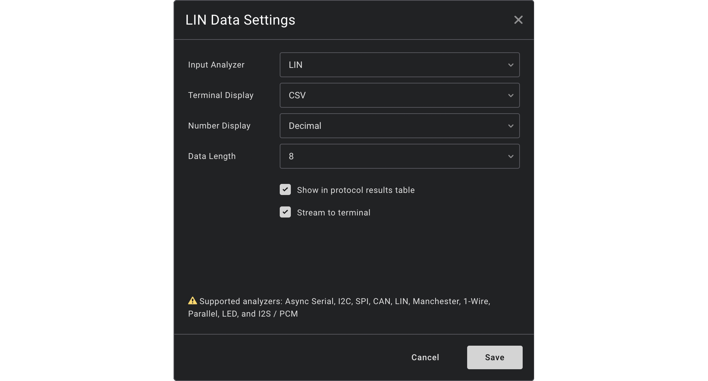

# LIN Data
**LIN Data** is a high-level extension for the LIN protocol designed for the Saleae Logic signal analyzer and protocol decoder.

It parses the Protected ID and Data frames and helps search for specific data and patterns. You can choose between decimal and hexadecimal representation, as well as an output in plaintext or CSV.

## Installation
Install **LIN Data** by clicking _Install_ on the **LIN Data** entry in the Extensions panel.

Click on the right Analyzer panel, then ***+*** ***LIN Data***

Select **LIN** as _Input Analyzer_, terminal and numeric display as preferred. As the LIN specification allows variable lengths for data transfer, you can choose the desired size of the excahnged data. If not sure, keep _8_ as default.

## Output

The plugin output can be visualized in the decoder view, table, and terminal view. CSV output in the terminal helps you easily export and post-process the data in your preferred software.

## Feedback & Issues

Issues and feature requests should be raised on GitHub using

- [`https://github.com/ma-lwa-re/logic-lin-data/issues/new`](https://github.com/ma-lwa-re/logic-lin-data/issues/new)
